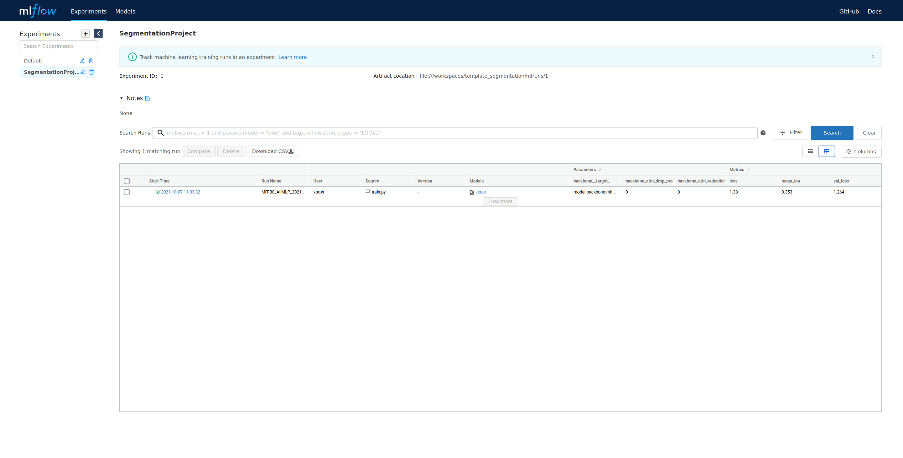

# Welcome to the semantic segmentation documentation of ECCO project


## How to use this project

!!! danger "Attention"

    If you want to this project, be sure to have installed :

    * [Docker](https://docs.docker.com/engine/install/ubuntu/),
    * [Nvidia Container Toolkit](https://github.com/NVIDIA/nvidia-docker) to allow containers to have access to GPUs.


This project can be used in 2 ways.

!!! warning "Warning"

    This project has only been tested with Python 3.8.
### First Choice

A Docker image has been provided, see the [Various configuration page](misc_config/docker.md) for further details about the writing of the Dockerfile. The base image from this Dockerfile is a TensorFlow image provided by [NVidia](https://ngc.nvidia.com/catalog/containers/nvidia:tensorflow/tags), this has the advantage to not bother you with the (quite difficult) installation of TensorFlow, CUDA, CuDNN, and other optimization softwares needed to make TensorFlow compatible with GPUs.

The shell commands needed to build and run the Docker container can be found below, they are also the provided in the [makefile](misc_config/make.md).

```shell
build_docker:
    docker build --build-arg USER_UID=$$(id -u) --build-arg USER_GID=$$(id -g) --rm -f Dockerfile -t segmentation_project:v1 .

run_docker:
    docker run --gpus all --shm-size=2g --ulimit memlock=-1 --ulimit stack=67108864 -it --rm -P --mount type=bind,source=$(PWD),target=/media/vorph/Datas/template_segmentation -e TF_FORCE_GPU_ALLOW_GROWTH=true -e XLA_FLAGS='--xla_gpu_autotune_level=2' segmentation_project:v1
```
Note that the container rely on mounting a volume, you can see that in the `run_docker` command : `--mount type=bind,source=$(PWD),target=/media/vorph/Datas/template_segmentation`, depending on where the project is installed, you will have to :

* either modify the Dockerfile to copy the entirety on the project inside the container, that way you wont have to mount any volume,
* or to modify the address of the mounted volume to make it correspond to where you have installed it.

Once you've done it, ie building and running the container, you have various [`requirements` files](misc_config/requirements.md) provided depending of what you want to do. we'll cover these requirements files later.

### Second Choice

If you already have a working environment **with TensorFlow installed**, like a virtual environement, an Azure, AWS, GCP instance, you can just install the project in this environment and use the various `requirements` files provided.

### Requirements files

!!! warning "Warning"

    These requirements files suppose that you already have a working environment **with TensorFlow installed**.

Three `requirements` files have been provided.


1. `requirements.txt` provides the minimum libraries needed to make the project work, **this supposes that you do not want to make any modifications, in the files located in the** `src` **folder** and you just want to use the project "as is". This file can be installed with the following command.
```shell
make install
```
2. `requirements-doc.txt` provides the libraries needed to generate this documentation. This file, and all the files above, can be installed with the following command.
```shell
make install-doc
```
3. `requirements-dev.txt` provides the libraries needed to make the project work in "development mode", ie **you want to modify or add a file in the** `src` **folder**. The libraries provided involve formatiing, linting, type hinting, refactoring, unit tests, etc. This file, and all the files above, can be installed with the following command.
```shell
make install-dev
```
## Steps to use it

### Step 0 : Create annotations for a semantic segmentation task.

You first need to create labels for your semantic segmentation task. This can be done with the use of [makesense.ai](https://www.makesense.ai/), once you have done the labellisation, be sure to download the annotations **in the VGG json style** provided by makesense.

### Step 1 : Put the images and annotations files in the right folder.

One you have your labels and images, put them in the `datas/raw_datas/images` folder for the images and in the `datas/raw_datas/labels` folder for the VGG json file.


### Step 2 : Generate the segmentation masks.

You need to generate masks from the raw annotations you have in your VGG json file. This is the purpose of the [`src/utils/utils_segmentation.py`](datasets/utils_segmentation.md) script, this script can be launched through the following shell command.
```shell
make segmentation_masks
```

The prepared images and masks ready to be made into datasets will be found in the `datas/raw_dataset/images` and `datas/raw_dataset/masks` folders.

### Step 3 : Create train, validation, and test datasets.

To generate the needed csv files to train and test a model, use the [`src/utils/make_dataset.py`](datasets/make_dataset.md) script, this script can be launched through the following shell command.
```shell
make prepared_dataset
```
The csv files will be found in the `datas/prepared_dataset` folder.


### Step 4 : Train a model.

To generate the configuration of the training loop, we use [Hydra](config_hydra/hydra.md), see the link for further explainations. Once you're satisfied with your training loop configuration, you can launch it via the following command.
```shell
make train
```

### Step 5 : Track your experiments.

This project use MLFlow to track the parameters of the various training loops you'll runs. To go to the mlflow web page, use the following command.
```shell
make mlflow
```


