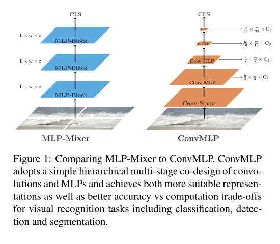
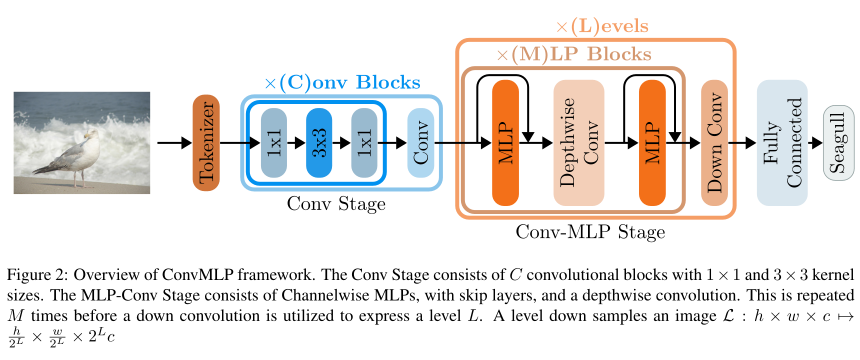

# ConvMLP: Hierarchical Convolutional MLPs for Vision

!!! note "Abstract"

    MLP-based architectures, which consist of a sequence of consecutive multi-layer perceptron blocks, have recently been found to reach comparable results to convolutional and transformer-based methods.

    However, most adopt spatial MLPs which take fixed dimension inputs, therefore making it difficult to apply them to downstream tasks, such as object detection and semantic segmentation. Moreover, single-stage designs further limit performance in other computer vision tasks and fully connected layers bear heavy computation.

    To tackle these problems, we propose ConvMLP: a hierarchical Convolutional MLP for visual recognition, which is a light-weight, stage-wise, co-design of convolution layers, and MLPs. In particular, ConvMLP-S achieves 76.8% top-1 accuracy on ImageNet-1k with 9M parameters and 2.4G MACs (15% and 19% of MLP-Mixer-B/16, respectively).

    Experiments on object detection and semantic segmentation further show that visual representation learned by ConvMLP can be seamlessly transferred and achieve competitive results with fewer parameters.

    [ArXiv link](https://arxiv.org/abs/2109.04454)






::: src.model.backbone.convmlp
    rendering:
        show_source: true


## Various configurations available as backbones
### ConvMLP-XS

```yaml
--8<-- "configs/backbone/convmlpXS.yaml"
```
### ConvMLP-S

```yaml
--8<-- "configs/backbone/convmlpS.yaml"
```

### ConvMLP-M

```yaml
--8<-- "configs/backbone/convmlpM.yaml"
```

### ConvMLP-L

```yaml
--8<-- "configs/backbone/convmlpL.yaml"
```
