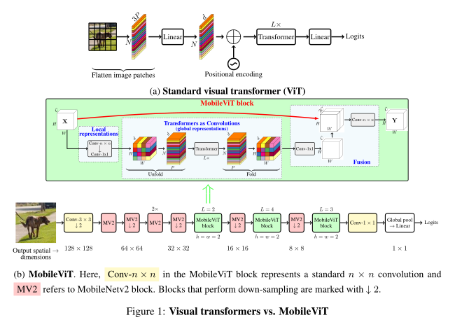

# MobileViT: Light-weight, General-purpose, and Mobile-friendly Vision Transformer

!!! note "Abstract"

    Light-weight convolutional neural networks (CNNs) are the de-facto for mobile vision tasks. Their spatial inductive biases allow them to learn representations with fewer parameters across different vision tasks. However, these networks are spatially local.

    To learn global representations, self-attention-based vision trans-formers (ViTs) have been adopted. Unlike CNNs, ViTs are heavy-weight. In this paper, we ask the following question: is it possible to combine the strengths of CNNs and ViTs to build a light-weight and low latency network for mobile vision tasks?

    Towards this end, we introduce MobileViT, a light-weight and general-purpose vision transformer for mobile devices. MobileViT presents a different perspective for the global processing of information with transformers, i.e., transformers as convolutions. Our results show that MobileViT significantly outperforms CNN- and ViT-based networks across different tasks and datasets. On the ImageNet-1k dataset, MobileViT achieves top-1 accuracy of 78.4% with about 6 million parameters, which is 3.2% and 6.2% more accurate than MobileNetv3 (CNN-based) and DeIT (ViT-based) for a similar number of parameters. On the MS-COCO object detection task, MobileViT is 5.7% more accurate than MobileNetv3 for a similar number of parameters.

    [ArXiv link](https://arxiv.org/abs/2110.02178)




::: src.model.backbone.mobilevit
    rendering:
        show_source: true


## Various configurations available as backbones

### MobileViT-S

```yaml
--8<-- "configs/backbone/mobilevit_s.yaml"
```

### MobileViT-XS

```yaml
--8<-- "configs/backbone/mobilevit_xs.yaml"
```

### MobileViT-XXS

```yaml
--8<-- "configs/backbone/mobilevit_xxs.yaml"
```
