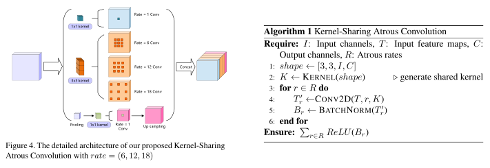

# See More Than Once -- Kernel-Sharing Atrous Convolution for Semantic Segmentation

!!! note "Abstract"

    The state-of-the-art semantic segmentation solutions usually leverage different receptive fields via multiple parallel branches to handle objects with different sizes. However, employing separate kernels for individual branches degrades the generalization and representation abilities of the network, and the number of parameters increases linearly in the number of branches. To tackle this problem, we propose a novel network structure namely Kernel-Sharing Atrous Convolution (KSAC), where branches of different receptive fields share the same kernel, i.e., let a single kernel see the input feature maps more than once with different receptive fields, to facilitate communication among branches and perform feature augmentation inside the network. Experiments conducted on the benchmark PASCAL VOC 2012 dataset show that the proposed sharing strategy can not only boost a network s generalization and representation abilities but also reduce the model complexity significantly. Specifically, on the validation set, whe compared with DeepLabV3+ equipped with MobileNetv2 backbone, 33% of parameters are reduced together with an mIOU improvement of 0.6%. When Xception is used as the backbone, the mIOU is elevated from 83.34% to 85.96% with about 10M parameters saved. In addition, different from the widely used ASPP structure, our proposed KSAC is able to further improve the mIOU by taking benefit of wider context with larger atrous rates. Finally, our KSAC achieves mIOUs of 88.1% and 45.47% on the PASCAL VOC 2012 test set and ADE20K dataset, respectively. Our full code will be released on the Github.

    [ArXiv link](https://arxiv.org/abs/1903.11816v1)

!!! note "Architecture"
    

::: src.model.layers.shared_kernels
    rendering:
        show_source: true

::: src.model.ksac
    rendering:
        show_source: true
